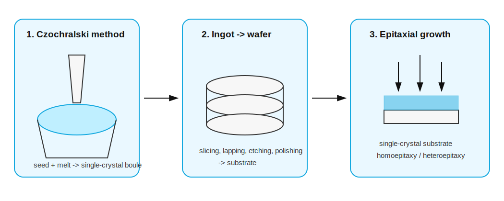

# 半导体材料生长

标签：#晶体结构 #CrystalGrowth #Epitaxy #Chapter1

## 一句话理解

高质量半导体器件依赖高纯度 `single-crystal` 材料；`Czochralski method` 产生体单晶衬底，而 `epitaxial growth` 用于在衬底上生长可控薄层。



## Growth from a melt

### Czochralski method

`Czochralski method` 的基本过程：

1. 将小块单晶 `seed` 接触同种材料的熔体 `melt`。
2. 缓慢拉出 seed。
3. 固-液界面处继续结晶。
4. 通常同时缓慢旋转晶体，使温度和成分更均匀。
5. 得到单晶硅棒 `ingot` 或 `boule`。

可在 melt 中加入受控杂质，例如 boron 或 phosphorus，使晶体在生长时被 intentionally doped。

### Zone refining

`Zone refining` 用于纯化材料。高温线圈沿晶棒移动，形成局部熔融区；许多杂质更偏向留在液相中，随着 molten zone 移动而被带到晶棒末端。

关键参数：

$$
\text{segregation coefficient} = \frac{C_s}{C_l}
$$

其中：

- $C_s$：固相中杂质浓度。
- $C_l$：液相中杂质浓度。

## Wafer 与 substrate

单晶 boule 经过：

```text
trimming → slicing → lapping → chemical etching → polishing
```

得到可用于器件制造的 wafer。最终作为后续工艺起点的晶圆称为 `substrate`。

## Epitaxial growth

`Epitaxial growth` 是在 single-crystal substrate 表面生长薄的单晶层。

| 类型 | English keyword | 含义 | 例子 |
|---|---|---|---|
| 同质外延 | `homoepitaxy` | 外延层与衬底材料相同 | Si on Si |
| 异质外延 | `heteroepitaxy` | 外延层与衬底材料不同但晶体结构相近 | AlGaAs on GaAs |

## 常见外延方法

### Chemical vapor-phase deposition, CVD

通过含目标原子的气相反应物在 heated substrate 表面反应并沉积，例如 Si epitaxial layer 可通过含硅气体沉积。

### Liquid-phase epitaxy, LPE

利用较低熔点的液相体系，在 seed crystal 上冷却生长单晶层，常用于 III-V compound semiconductors。

### Molecular beam epitaxy, MBE

在真空中把 semiconductor atoms 和 dopant atoms 蒸发到衬底表面。优点是组分和 doping profile 可高度精确控制。

## 易错点

- bulk crystal growth 主要产生 substrate；epitaxy 主要控制表面薄层。
- heteroepitaxy 不是任意材料都能配对，晶格和结构差异过大会引入大量 defects。
- ion implantation 和 epitaxy 都可控制掺杂或材料层，但物理过程完全不同。

## 相关链接

- [[半导体材料]]
- [[缺陷与杂质]]
- [[闪锌矿结构]]
