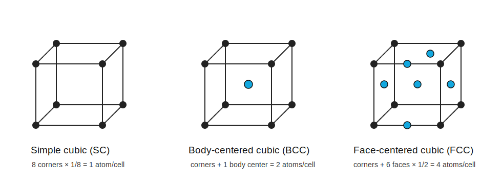

# 基本晶体结构

标签：#晶体结构 #SC #BCC #FCC #Chapter1

## 一句话理解

`Simple cubic`、`body-centered cubic` 和 `face-centered cubic` 是理解更复杂半导体晶体结构前的三个基本 cubic structures。

## 三种结构对比

| 结构 | English keyword | 单位晶胞内等效原子数 | 体密度 volume density |
|---|---:|---:|---:|
| 简单立方 | `simple cubic`, SC | 1 | $1/a^3$ |
| 体心立方 | `body-centered cubic`, BCC | 2 | $2/a^3$ |
| 面心立方 | `face-centered cubic`, FCC | 4 | $4/a^3$ |

其中 $a$ 是 cubic unit cell 的 `lattice constant`。

## 原子计数规则

- 角点 atom 被 8 个相邻晶胞共享，所以贡献 $1/8$。
- 面心 atom 被 2 个相邻晶胞共享，所以贡献 $1/2$。
- 体心 atom 完全属于本晶胞，所以贡献 1。

## 体密度计算模板

$$
\text{Volume density} = \frac{\text{number of atoms per unit cell}}{\text{volume of unit cell}}
$$

对于立方晶胞，体积为：

$$
V_\text{cell} = a^3
$$

## Surface density 的思路

`surface density` 是某个晶面上单位面积内的原子数：

$$
\text{Surface density} = \frac{\text{number of atoms on plane}}{\text{area of plane}}
$$

注意：surface density 依赖具体晶面，例如 `(100)`、`(110)`、`(111)` 的结果通常不同。

## 易错点

- 体密度看整个 unit cell；面密度只看某一个晶面。
- FCC 中一个面心原子不能算 1 个完整原子，要算 $1/2$。
- 角点原子在 3D 晶胞中一定按 $1/8$ 计入。

## 相关链接

- [[空间晶格与晶胞]]
- [[晶面与密勒指数]]
- [[金刚石结构]]
