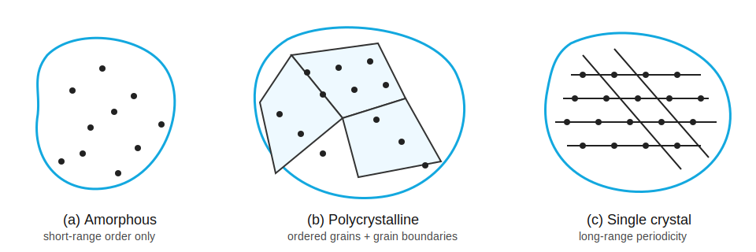
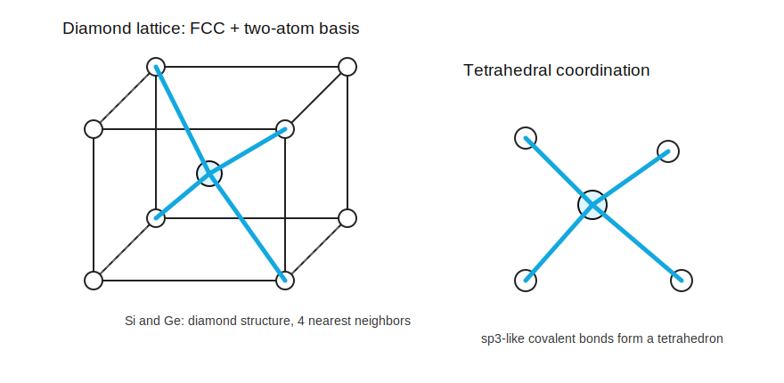

# 晶体结构

标签：#晶体结构 #Chapter1 #总览

来源：Chapter 1 *The Crystal Structure of Solids*

## 本章一句话

半导体的电学性质不仅由化学组成决定，也强烈依赖原子在固体中的排列方式；对器件而言，理解 `single crystal`、`unit cell`、`Miller indices`、`diamond structure` 和 `defects` 是后续学习能带、载流子输运与 PN 结的基础。

## 本章知识链

```text
semiconductor materials
  → types of solids
  → lattice / unit cell
  → SC / BCC / FCC
  → crystal planes / Miller indices
  → crystal directions
  → diamond / zincblende structure
  → atomic bonding
  → defects / impurities / doping
  → crystal growth / epitaxy
```

## 视觉索引






## 笔记入口

- [[半导体材料]]
- [[固体类型]]
- [[空间晶格与晶胞]]
- [[基本晶体结构]]
- [[晶面与密勒指数]]
- [[晶向]]
- [[金刚石结构]]
- [[闪锌矿结构]]
- [[原子键合]]
- [[缺陷与杂质]]
- [[半导体材料生长]]
- [[第一章公式与考点速查]]

## 和后续章节的连接

- `diamond structure` 决定 Si / Ge 的四面体共价键结构，是理解后续 [[能带与禁带]] 的材料背景。
- `Miller indices` 用于描述晶圆表面取向，例如 `(100)` wafer、`(111)` plane。
- `defects` 与 `impurities` 会引入散射、复合中心或受主/施主能级，是理解 [[02-载流子统计/本征半导体与杂质半导体]] 和 [[03-输运现象/迁移率]] 的前置知识。
- `epitaxial growth` 决定器件表面层质量，与 MOS、BJT、光电器件工艺紧密相关。

## 复习优先级

1. 先会区分 `amorphous`、`polycrystalline`、`single crystal`。
2. 再掌握 `unit cell` / `primitive cell` / `lattice constant`。
3. 必须熟练 `Miller indices` 的求法。
4. 重点记住 Si 的 `diamond structure`：每个原子有 4 个 nearest neighbors。
5. 理解 `doping` 是通过受控杂质改变半导体导电性。
