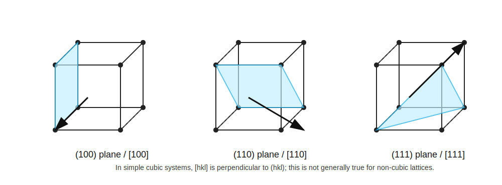

# 晶向

标签：#晶体结构 #晶向 #Direction #Chapter1

## 一句话理解

`Crystal direction` 用方括号 `[hkl]` 表示，是晶体中某个方向矢量的整数分量。

## 定义

在晶体中，一个方向可以用三个整数分量表示：

$$
[hkl]
$$

例如，在 simple cubic lattice 中：

- `[100]`：沿一个晶轴方向。
- `[110]`：面对角线方向。
- `[111]`：体对角线方向。

## 与晶面的关系

在 cubic lattice 中，`[hkl]` direction 与 `(hkl)` plane 垂直。

例如：

- `[100]` 垂直 `(100)`。
- `[110]` 垂直 `(110)`。
- `[111]` 垂直 `(111)`。

但是这个关系不一定适用于 non-cubic lattice。

## 记号对比

| 记号 | English keyword | 含义 |
|---|---|---|
| `[hkl]` | direction | 一个具体晶向 |
| `<hkl>` | direction family | 一族等价晶向 |
| `(hkl)` | plane | 一个具体晶面 |
| `{hkl}` | plane family | 一族等价晶面 |

## 为什么重要？

- 晶圆加工常依赖晶向和晶面。
- 晶体各向异性会使某些物理性质随方向变化。
- 器件版图、劈裂方向、表面取向都可能涉及 crystal direction。

## 易错点

- `[111]` 是方向，不是平面。
- `(111)` 是平面，不是方向。
- 只有在 cubic system 中，`[hkl]` 与 `(hkl)` 的垂直关系才最直接。

## 相关链接

- [[晶面与密勒指数]]
- [[空间晶格与晶胞]]
