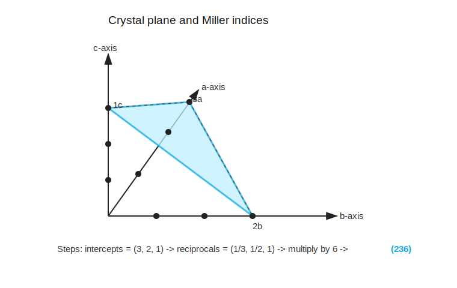

# 晶面与密勒指数

标签：#晶体结构 #MillerIndices #晶面 #Chapter1

## 一句话理解

`Miller indices` 是用一组三个整数 `(hkl)` 描述晶体中某个 plane 的方法；半导体器件常在特定晶面或近表面区域制造，因此晶面取向非常重要。

## 为什么要描述晶面？

真实晶体不是无限大，最终会终止于 surface。许多半导体器件是在 surface 或 near-surface 区域制造的，所以 surface properties 会影响器件特性。

## Miller indices 的求法

给定一个晶面：

1. 找出该平面与 $\vec a, \vec b, \vec c$ 三个轴的截距。
2. 把截距写成 lattice constants 的倍数，例如 $(3,2,1)$。
3. 取倒数，例如 $(1/3,1/2,1)$。
4. 乘以最小公倍数，使其变成最小整数比。
5. 写成 `(hkl)`。

## 例子：`(236)` plane

若截距为：

$$
3a,\quad 2b,\quad 1c
$$

则：

$$
\left(\frac{1}{3},\frac{1}{2},1\right) \times 6 = (2,3,6)
$$

所以晶面为：

$$
(236)
$$

## 记号规则

| 记号 | 意义 |
|---|---|
| `(hkl)` | 某一个晶面 |
| `{hkl}` | 一族等价晶面，plane family |
| `[hkl]` | 某一个晶向，direction |
| `<hkl>` | 一族等价晶向，direction family |

## 特殊情况

- 若平面平行于某个轴，则截距为无穷大，倒数为 0。
- 若截距为负，通常在对应指数上加横线，例如 $(\bar{1}10)$。
- 平行晶面具有相同的 Miller indices。

## 高频考法

- 给出截距，求 `(hkl)`。
- 给出 `(hkl)`，画出晶面。
- 计算某晶面的 `surface density`。
- 判断晶圆 surface orientation，例如 `(100)` wafer。

## 易错点

- Miller indices 来自截距的倒数，而不是截距本身。
- `(hkl)` 是 plane；`[hkl]` 是 direction，括号不能混用。
- 只在 cubic lattice 中，`[hkl]` 通常垂直于 `(hkl)`。

## 相关链接

- [[晶向]]
- [[基本晶体结构]]
- [[第一章公式与考点速查]]
