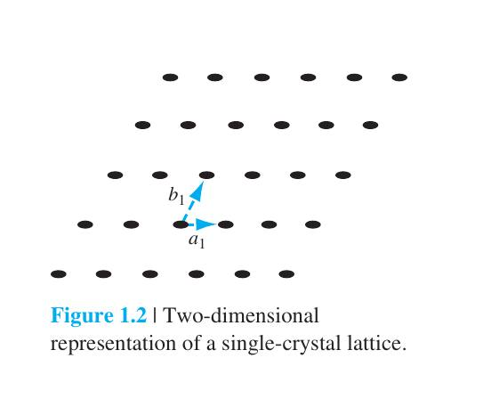
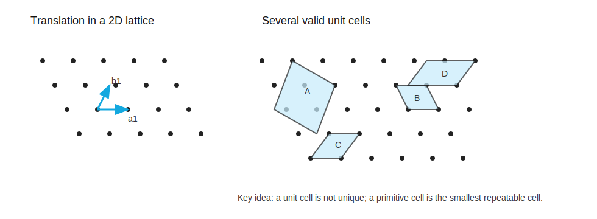
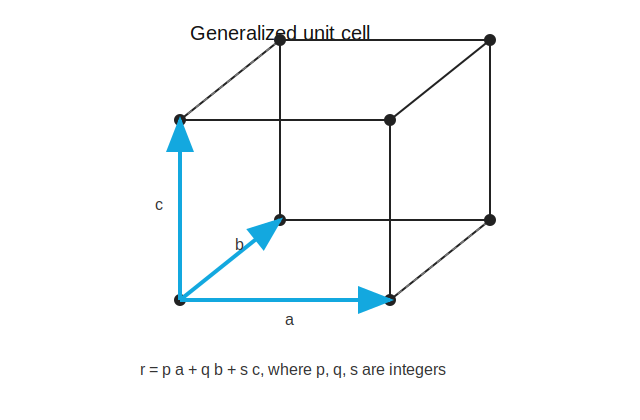

# 空间晶格与晶胞

标签：#晶体结构 #晶格 #晶胞 #Chapter1

## 一句话理解

`Lattice` 是晶体中原子排列的周期性骨架；`unit cell` 是能通过平移复制出整个晶体的最小或便利重复单元。

## 基本定义

### Lattice point

`Lattice point` 是用来代表某个重复原子组或结构基元的位置点。

### Lattice

`Lattice` 是 lattice points 在空间中的周期性排列。

### Unit cell

`Unit cell` 是一个小体积晶胞，经过三维平移后可以重构整个晶体。

### Primitive cell

`Primitive cell` 是最小的 unit cell。实际计算中常常选用非 primitive cell，因为它可能具有更直观的正交边和更高对称性。

## 平移矢量

三维晶格中的等价 lattice point 可以写成：

$$
\vec r = p\vec a + q\vec b + s\vec c
$$

其中：

- $\vec a, \vec b, \vec c$：晶胞的三个 lattice vectors。
- $p, q, s$：整数。
- $|\vec a|, |\vec b|, |\vec c|$：`lattice constants`。

## Unit cell 为什么不唯一？

同一个二维或三维 lattice 可以用多种 unit cells 表示。选择原则通常是：

- 计算方便。
- 对称性清楚。
- 与实验或工艺中的晶向、晶面描述一致。

## 重要判断

- 能平移复制出整个晶体：是 unit cell。
- 在所有 unit cells 中体积最小：是 primitive cell。
- 对称性更好但不是最小：仍可能是更常用的 conventional unit cell。

## 易错点

- `unit cell` 不一定等于 `primitive cell`。
- lattice vectors 不一定互相垂直。
- lattice point 不一定代表一个原子，也可能代表一组原子，即 basis。

## 相关链接

- [[基本晶体结构]]
- [[晶面与密勒指数]]
- [[晶向]]
