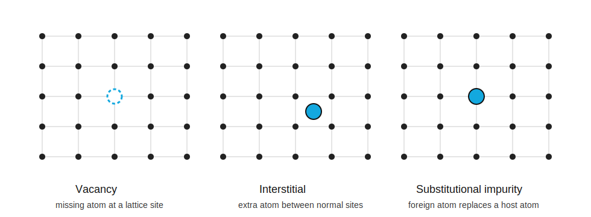

# 缺陷与杂质

标签：#晶体结构 #Defects #Impurities #Doping #Chapter1

## 一句话理解

真实晶体不是完美周期结构；缺陷（defects）和杂质（impurities）会破坏理想晶格，并显著改变半导体的电学性质。

## 晶格振动

晶格振动（lattice vibrations）是所有晶体都存在的热扰动。温度不为 0 时，原子会围绕平衡晶格位置（lattice site）随机振动。

影响：

- 破坏严格的几何周期性。
- 增加载流子散射（carrier scattering）。
- 影响迁移率（mobility）、电阻率（resistivity）等电学参数。

## 点缺陷

| 缺陷 | English keyword | 含义 |
|---|---|---|
| 空位 | `vacancy` | 某个晶格位置缺少原子 |
| 间隙原子 | `interstitial` | 原子位于正常晶格位置之间 |
| 替位杂质 | `substitutional impurity` | 外来原子占据正常晶格位置 |
| 间隙杂质 | `interstitial impurity` | 外来原子位于晶格位置之间 |

## 杂质（impurities）

外来原子进入晶体后，可能是惰性的，也可能极大改变电学性质。

在 Si 中：

- 氧（oxygen）可能相对惰性（inert）。
- 磷（phosphorus）、硼（boron）等可用于受控改变导电性。
- 金（gold）等深能级杂质会显著影响复合过程。

## 掺杂（doping）

掺杂（doping）是向半导体中加入受控数量的杂质原子，以改变导电性的过程。

两个基本方法：

### 杂质扩散（impurity diffusion）

在高温下，杂质从表面高浓度区向晶体内部低浓度区扩散。降温后，许多杂质会冻结在替位晶格位置（substitutional lattice sites）。

### 离子注入（ion implantation）

把高能杂质离子（impurity ions）加速后打入半导体表面。优点是剂量和深度较可控；缺点是会造成晶格位移损伤（lattice-displacement damage），因此通常需要热退火（thermal annealing）修复。

## 与后续章节连接

- 掺杂（doping）直接引出 n 型 / p 型半导体，见 [[03-半导体平衡态/掺杂与杂质能级]]。
- 缺陷（defects）会影响少数载流子寿命（minority carrier lifetime），见 [[05-非平衡载流子/过剩载流子寿命与SRH复合]]。
- 杂质（impurities）可能成为复合中心（recombination centers）。
- 晶格振动（lattice vibration）会影响迁移率（mobility），见 [[04-输运现象/迁移率与散射]]。

## 易错点

- 缺陷不一定都是外来原子，空位（vacancy）也是缺陷。
- 杂质不一定都是坏的；受控掺杂是半导体工艺的核心。
- 离子注入后通常需要退火（annealing）。

## 相关链接

- [[半导体材料]]
- [[原子键合]]
- [[03-半导体平衡态/掺杂与杂质能级]]
