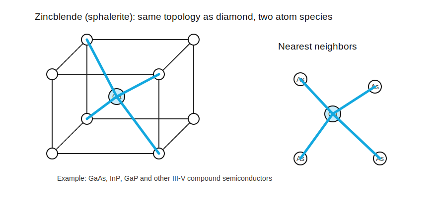

# 闪锌矿结构

标签：#晶体结构 #Zincblende #GaAs #Chapter1

## 一句话理解

`Zincblende lattice` 可以看成 diamond lattice 的双原子版本：拓扑结构类似，但相邻位置由两种不同原子占据。

## 典型材料

- GaAs
- GaP
- InP
- AlAs

这些通常属于 III-V 族 `compound semiconductors`。

## 与 diamond structure 的关系

| 结构 | 原子种类 | 典型材料 | 最近邻构型 |
|---|---|---|---|
| `diamond lattice` | 一种原子 | Si, Ge | tetrahedral |
| `zincblende lattice` | 两种原子 | GaAs, InP | tetrahedral |

## GaAs 的物理图像

在 GaAs 中：

- Ga 是 III 族元素。
- As 是 V 族元素。
- 每个 Ga 周围有 4 个 As nearest neighbors。
- 每个 As 周围有 4 个 Ga nearest neighbors。

这种结构保持四面体配位，但由于两种原子不同，材料性质与 Si 有明显差异，例如光学性质更突出。

## 为什么重要？

- GaAs 的光学性质使其适合 optical devices。
- III-V 半导体常用于高速器件、激光器、LED、光电探测器等。
- `zincblende` 是后续学习 heterojunction、quantum well、laser diode 的重要结构背景。

## 易错点

- zincblende 不是“无序混合”，而是两种原子按固定晶格位置周期排列。
- zincblende 与 diamond lattice 很像，但 diamond lattice 只有一种原子。
- GaAs 不是元素半导体，而是 binary compound semiconductor。

## 相关链接

- [[半导体材料]]
- [[金刚石结构]]
- [[原子键合]]
