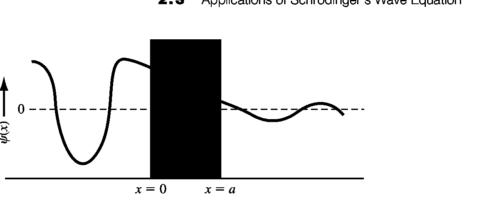

# 势阱势垒与隧穿

标签：#量子力学 #PotentialWell #PotentialBarrier #Tunneling

## 一句话理解

用 Schrodinger equation 解不同 `potential functions` 可以看到：free electron 对应 traveling wave，bound electron 对应 standing wave 与 quantized energies，而 finite barrier 会导致 tunneling。

## Free electron

$$
\phi(x)=Ae^{jkx}+Be^{-jkx}
$$

$$
k=\frac{\sqrt{2mE}}{\hbar}=\frac{p}{\hbar}=\frac{2\pi}{\lambda}
$$

## Infinite potential well

$$
\phi_n(x)=\sqrt{\frac{2}{a}}\sin\left(\frac{n\pi x}{a}\right)
$$

$$
E_n=\frac{\hbar^2n^2\pi^2}{2ma^2}
$$

## Potential barrier and tunneling

$$
T\approx 16\left(\frac{E}{V_0}\right)\left(1-\frac{E}{V_0}\right)e^{-2k_2a}
$$

$$
k_2=\sqrt{\frac{2m(V_0-E)}{\hbar^2}}
$$

## 和半导体器件的联系

- Tunneling 是 tunnel diode 等器件的基本机制。
- Barrier width $a$ 越大，tunneling probability 指数下降。
- Effective mass 会影响 $k_2$，因此会影响 tunneling probability。
