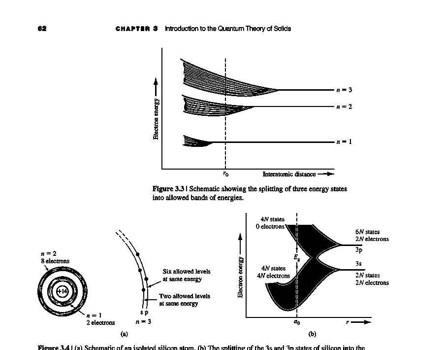
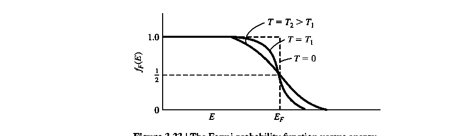

# 固体量子理论

标签：#量子力学 #能带理论 #Chapter3

来源：Chapter 3 *Introduction to the Quantum Theory of Solids*

## 本章一句话

Chapter 3 把 Chapter 2 中的 quantum mechanics 推广到 crystal lattice：原子能级在晶体中分裂成 `allowed energy bands` 与 `forbidden energy bands`，并由此建立 semiconductor 的 conduction band、valence band、electron、hole、effective mass、density of states 与 Fermi-Dirac statistics。

## 本章知识链

```text
atomic discrete energy levels
  -> interaction between atoms
  -> energy band splitting
  -> allowed / forbidden energy bands
  -> Kronig-Penney model and Bloch theorem
  -> E-k diagram and crystal momentum
  -> conduction band / valence band
  -> electron / hole and effective mass
  -> direct / indirect bandgap
  -> density of states
  -> Fermi-Dirac distribution and Fermi energy
```

## 视觉索引






## 核心概念

### Allowed energy band

`Allowed energy band` 是晶体中电子允许占据的一段能量范围。它来自大量相邻原子的 atomic energy levels 相互作用后发生 splitting。

### Forbidden energy band

`Forbidden energy band` 是电子不能占据的能量范围。semiconductor 的 `bandgap energy` $E_g$ 就是 conduction band bottom 与 valence band top 之间的 forbidden energy range。

### Conduction band 与 valence band

- `Conduction band`：电子可以较自由运动并参与导电的能带。
- `Valence band`：价电子所在能带；若出现 empty state，就可用 `hole` 描述其电流贡献。

### Electron 与 hole

半导体中存在两类重要载流子：

- `electron`：negative charge，通常位于 conduction band bottom。
- `hole`：positive charge，对应 valence band 中的 empty electronic state。

### Effective mass

`Effective mass` 把 crystal internal forces 的影响吸收到一个等效参数中，使电子和空穴仍能用近似 Newtonian mechanics 描述。

## 和后续章节的连接

- [[03-输运现象/漂移电流]]：drift current 需要 electron / hole 的 velocity 与 effective mass。
- [[02-载流子统计/态密度]]：density of states 与 Fermi-Dirac distribution 用于计算 carrier concentration。
- [[02-载流子统计/费米能级]]：Fermi energy 是判断能态占据概率的关键参数。

## 复习优先级

1. 能解释为什么 isolated atomic levels 会分裂成 bands。
2. 能说明 `allowed band`、`forbidden band`、`bandgap` 的关系。
3. 能读懂简化的 `E-k diagram`。
4. 能解释 `hole` 为什么等效为 positive charge carrier。
5. 能写出 density of states 的能量依赖。
6. 能解释 Fermi-Dirac distribution 与 Fermi energy 的意义。
