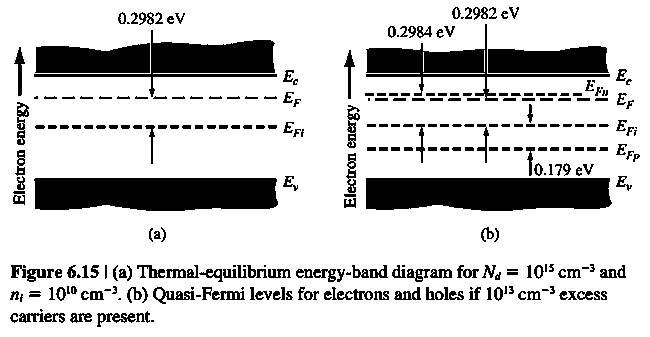

# 准费米能级

标签：#非平衡载流子 #QuasiFermiLevel #Chapter6

## 一句话理解

nonequilibrium 下单一 Fermi level 不再严格适用；但可以分别为 electrons 和 holes 定义 `quasi-Fermi levels`，用来描述各自的 carrier concentration。

## Equilibrium relation

thermal equilibrium 中：

$$
n_0=n_i\exp\left(\frac{E_F-E_{Fi}}{kT}\right)
$$

$$
p_0=n_i\exp\left(\frac{E_{Fi}-E_F}{kT}\right)
$$

此时 electrons 和 holes 共用一个 $E_F$。

## Nonequilibrium relation

有 excess carriers 时：

$$
n=n_0+\delta n=n_i\exp\left(\frac{E_{Fn}-E_{Fi}}{kT}\right)
$$

$$
p=p_0+\delta p=n_i\exp\left(\frac{E_{Fi}-E_{Fp}}{kT}\right)
$$

其中：

- $E_{Fn}$：electron quasi-Fermi level。
- $E_{Fp}$：hole quasi-Fermi level。

## 分裂的物理意义

quasi-Fermi level splitting 表示系统偏离 thermal equilibrium 的程度。

- $E_{Fn}$ 越接近 $E_c$，electron concentration 越高。
- $E_{Fp}$ 越接近 $E_v$，hole concentration 越高。
- equilibrium 时 $E_{Fn}=E_{Fp}=E_F$。

## 和 PN 结的联系

forward-biased PN junction 中，electron 和 hole quasi-Fermi levels 会分开。这个分裂与 injected minority carrier concentration 和 junction voltage 直接相关。

## 易错点

- quasi-Fermi level 不是新能带，而是描述 nonequilibrium occupation 的参数。
- nonequilibrium 中通常不能用一个 $E_F$ 同时描述 electrons 和 holes。
- low injection 时 majority carrier quasi-Fermi level 常变化很小，minority carrier quasi-Fermi level 变化显著。
