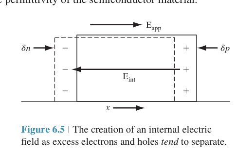

# 双极输运与双极输运方程

标签：#非平衡载流子 #AmbipolarTransport #Chapter6

## 一句话理解

`ambipolar transport` 指 excess electrons 和 excess holes 由于 internal electric field 的耦合而一起 drift、diffuse、recombine，不能作为两个完全独立的粒子云处理。

## 为什么 excess carriers 不独立运动？

若 applied electric field 存在，electrons 和 holes 会倾向于向相反方向 drift。若只有 diffusion，二者的 diffusion coefficients 也不同，会导致 separation。

一旦发生微小 separation，就会形成 internal electric field：

$$
E=E_{app}+E_{int}
$$

这个 internal field 把 electrons 和 holes 拉回一起，使二者保持近似 quasi-neutrality：

$$
\delta n\approx \delta p
$$

## Poisson equation

internal field 与局部净电荷相关：

$$
\nabla\cdot E_{int}=\frac{e(\delta p-\delta n)}{\epsilon_s}
$$

即使 $\delta p-\delta n$ 很小，也足以产生 non-negligible internal field。

## Ambipolar transport equation

通过组合 electron / hole time-dependent diffusion equations 并消去 $\partial E/\partial x$ 项，可得一维 ambipolar transport equation：

$$
D'\frac{\partial^2(\delta n)}{\partial x^2}+\mu'E\frac{\partial(\delta n)}{\partial x}+g-R=\frac{\partial(\delta n)}{\partial t}
$$

其中：

$$
D'=\frac{\mu_n nD_p+\mu_p pD_n}{\mu_n n+\mu_p p}
$$

$$
\mu'=\frac{\mu_n\mu_p(p-n)}{\mu_n n+\mu_p p}
$$

使用 Einstein relation，也可写：

$$
D'=\frac{D_nD_p(n+p)}{D_n n+D_p p}
$$

## 非线性来源

$D'$ 和 $\mu'$ 依赖 total carrier concentrations $n$ 与 $p$，而 $n$、$p$ 又包含 excess concentration。因此 general ambipolar equation 是 nonlinear differential equation。

## 易错点

- ambipolar transport 不是简单把 electron current 和 hole current 相加。
- quasi-neutrality 不代表 internal field 为严格 0，而是净电荷差极小。
- internal field 是让 excess carriers 共同运动的关键。
