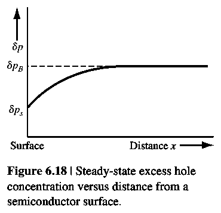

# 表面态与表面复合

标签：#非平衡载流子 #SurfaceStates #SurfaceRecombination #Chapter6

## 一句话理解

semiconductor surface 终止了 ideal periodic potential，会在 bandgap 中形成 surface states；这些 states 可作为 recombination centers，使 surface 附近的 excess carrier concentration 低于 bulk。

## Surface states

bulk semiconductor 中 defect density 较小时，trap states 可能是 discrete levels。surface 由于 periodic potential abrupt termination，通常产生一组 distributed surface states。

这些 surface states 会增加 recombination rate，因此 surface excess minority carrier lifetime 通常小于 bulk lifetime：

$$
\tau_{p0s}<\tau_{p0}
$$

## Surface concentration

若 steady-state generation rate 在 bulk 和 surface 处相同，bulk recombination rate 与 surface recombination rate 可比较：

$$
\frac{\delta p_B}{\tau_{p0}}=\frac{\delta p_s}{\tau_{p0s}}
$$

若 $\tau_{p0s}<\tau_{p0}$，则：

$$
\delta p_s<\delta p_B
$$

## Surface recombination velocity

surface 附近出现 excess carrier concentration gradient，因此 carriers 会向 surface diffusion 并 recombine。

boundary condition：

$$
D_p\left(\hat n\cdot\frac{d(\delta p)}{dx}\right)_{surf}=s\delta p_{surf}
$$

在常见一维几何中可写：

$$
D_p\frac{d(\delta p)}{dx}\bigg|_{surf}=s\delta p\big|_{surf}
$$

其中 $s$ 是 `surface recombination velocity`，单位 cm/s。

## 典型解

对 n-type semiconductor，zero field，uniform generation，surface at $x=0$，bulk excess concentration $g'\tau_{p0}$：

$$
\delta p(x)=g'\tau_{p0}\left(1-\frac{sL_pe^{x/L_p}}{D_p+sL_p}\right)
$$

其中：

$$
L_p=\sqrt{D_p\tau_{p0}}
$$

## 物理意义

- $s=0$：perfectly passivated surface，surface 不额外复合。
- $s\to\infty$：perfect recombination surface，surface excess concentration 近似 0。
- solar cell、photodiode、MOS interface 都强烈受 surface recombination 影响。

## 易错点

- surface recombination velocity 是边界参数，不是 carrier drift velocity。
- surface recombination 通过 concentration gradient 间接影响 bulk near-surface region。
- passivation 的目的之一就是降低 surface states 和 surface recombination velocity。
