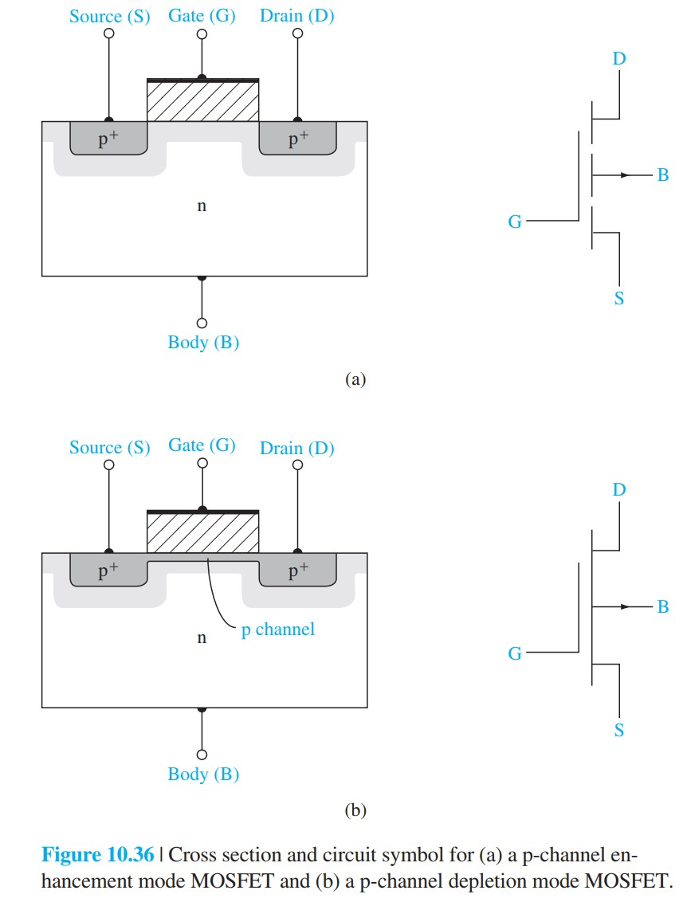
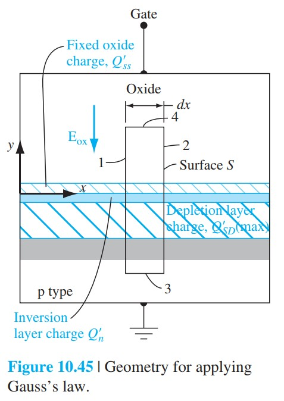

# MOSFET结构与工作区

标签：#MOSFET #增强型 #耗尽型 #工作区 #Chapter10

## 一句话理解

MOSFET 用栅压在源漏之间创建或调制反型沟道；漏源电压再沿沟道建立横向电场，使沟道电荷漂移形成漏电流。

## 四种基本器件

MOSFET 可按沟道类型和工作模式分类：

- n 沟道增强型 MOSFET（n-channel enhancement-mode MOSFET）：零栅压无沟道，$V_{GS}>V_T$ 后形成电子反型沟道。
- p 沟道增强型 MOSFET（p-channel enhancement-mode MOSFET）：零栅压无沟道，负栅压超过阈值后形成空穴沟道。
- n 沟道耗尽型 MOSFET（n-channel depletion-mode MOSFET）：零栅压已有 n 型沟道，负栅压可耗尽沟道。
- p 沟道耗尽型 MOSFET（p-channel depletion-mode MOSFET）：零栅压已有 p 型沟道，正栅压可耗尽沟道。

> [!figure] Fig-10-36
> 
> 增强型和耗尽型 MOSFET 结构对比。

## n 沟道增强型的基本工作

以 p 型衬底为例：

```text
V_GS < V_T
  -> 没有连续电子反型沟道
  -> 源漏之间近似断开

V_GS > V_T
  -> 表面形成电子反型层
  -> n+ 源区与 n+ 漏区被沟道连接
  -> V_DS 建立横向电场
  -> 电子从源到漏漂移，常规定义的 I_D 从漏流入
```

> [!figure] Fig-10-43
> 
> n 沟道增强型 MOSFET 的反型沟道形成。

## 线性区与饱和区

### 线性区 / 三极区

当 $0<V_{DS}<V_{GS}-V_T$ 时，沟道从源到漏都存在反型电荷，器件近似像由栅压控制的电阻。

### 饱和区

当 $V_{DS}\ge V_{GS}-V_T$ 时，漏端沟道电荷降到零，称为夹断（pinch-off）。理想长沟道模型中，再增加 $V_{DS}$，$I_D$ 近似保持常数。

饱和边界：

$$
V_{DS}(sat)=V_{GS}-V_T
$$

> [!figure] Fig-10-45
> 
> 漏源电压增大时，沟道电荷在漏端逐渐减少并进入夹断。

## p 沟道器件的符号处理

p 沟道 MOSFET 的电压和电流方向与 n 沟道相反。复习时建议先用“幅值形式”理解：

$$
|V_{DS}(sat)|=|V_{GS}|-|V_T|
$$

只要记住：p 沟道由空穴导电，栅压通常向负方向打开沟道。

## 易错点

- 夹断不是电流为零，而是漏端沟道电荷为零后电流进入饱和。
- 增强型 MOSFET 零栅压没有沟道；耗尽型 MOSFET 零栅压已有沟道。
- 源和漏在几何上可对称，但在偏置下由电势较低 / 较高端决定源漏角色。
- MOSFET 是多数载流子器件，不依赖少数载流子存储，因此速度通常比双极型少数载流子器件快。

## 连接

- 前接 [[MOS电容基础图像]] 与 [[功函数差平带电压与阈值电压]]。
- 后接 [[MOSFET理想IV方程]]：线性区和饱和区公式来自沿沟道积分反型电荷。
