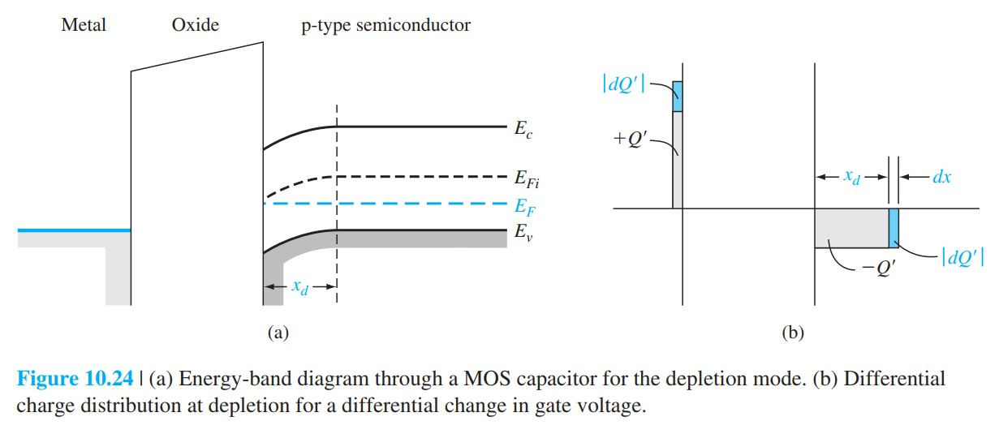
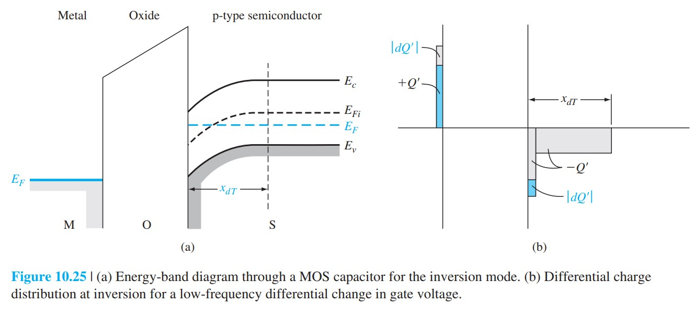

# MOS电容CV特性

标签：#MOS电容 #CV特性 #低频 #高频 #界面态 #Chapter10

## 一句话理解

MOS 电容 C-V 特性反映栅极小信号电荷由哪些电荷响应：积累区接近氧化层电容，耗尽区是氧化层电容和耗尽层电容串联，反型区则取决于少数载流子是否能跟上小信号频率。

## 基本等效电容

氧化层电容：

$$
C'_{ox}=\frac{\varepsilon_{ox}}{t_{ox}}
$$

耗尽层电容：

$$
C'_d=\frac{\varepsilon_s}{x_d}
$$

耗尽区小信号总电容为串联形式：

$$
C'=\frac{C'_{ox}C'_d}{C'_{ox}+C'_d}
$$

当耗尽层达到最大宽度 $x_{dT}$ 时：

$$
C'_{min}=\frac{C'_{ox}C'_{dT}}{C'_{ox}+C'_{dT}}
$$

其中：

$$
C'_{dT}=\frac{\varepsilon_s}{x_{dT}}
$$

## p 型衬底的 C-V 分区

```text
负栅压：积累区
  -> 多数空穴能快速响应
  -> C' ≈ C'_ox

适度正栅压：耗尽区
  -> 耗尽层宽度随栅压增加
  -> C' 逐渐下降

大正栅压：反型区
  -> 是否恢复到 C'_ox 取决于测量频率
```

> [!figure] Fig-10-24
> 
> 理想 MOS 电容的 C-V 特性示意。

## 低频与高频差异

### 低频 C-V

低频下，少数载流子能通过产生-复合过程跟随小信号变化。进入反型后，新增电荷主要进入反型层，所以电容重新接近 $C'_{ox}$。

### 高频 C-V

高频下，少数载流子来不及产生和复合，反型层电荷不能跟随小信号变化；小信号电荷主要仍由耗尽层边界移动承担，因此电容停留在近似最小值 $C'_{min}$。

> [!figure] Fig-10-25
> 
> 低频与高频 MOS C-V 曲线对比。

## 固定氧化层电荷与界面态影响

固定氧化层电荷（fixed oxide charge）主要导致 C-V 曲线沿电压轴平移：

$$
\Delta V_{FB}=-\frac{Q'_{ss}}{C'_{ox}}
$$

界面态（interface states）可能在某些频率下参与充放电，从而改变曲线斜率和形状。

## 从 C-V 提取参数

MOS C-V 常用于提取：

- 氧化层厚度：由积累区 $C'_{ox}$ 得到。
- 衬底掺杂：由耗尽区电容变化得到。
- 平带电压：由曲线位置得到。
- 氧化层固定电荷和界面态信息：由理想曲线偏移和畸变判断。

## 易错点

- 积累区电容接近 $C'_{ox}$，不是因为没有半导体影响，而是多数载流子在界面快速响应。
- 高频反型区电容不回升，是因为少数载流子不能跟随小信号，不是因为反型层不存在。
- 固定氧化层电荷通常表现为电压轴平移；界面态则可能同时改变曲线形状。
- C-V 曲线方向和衬底类型有关，p 型和 n 型衬底的栅压极性相反。

## 连接

- 前接 [[功函数差平带电压与阈值电压]]。
- 后接 [[MOSFET结构与工作区]]：MOSFET 的栅控沟道本质上来自 MOS 电容反型层。
