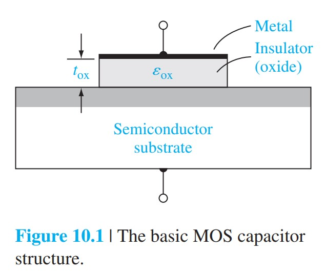
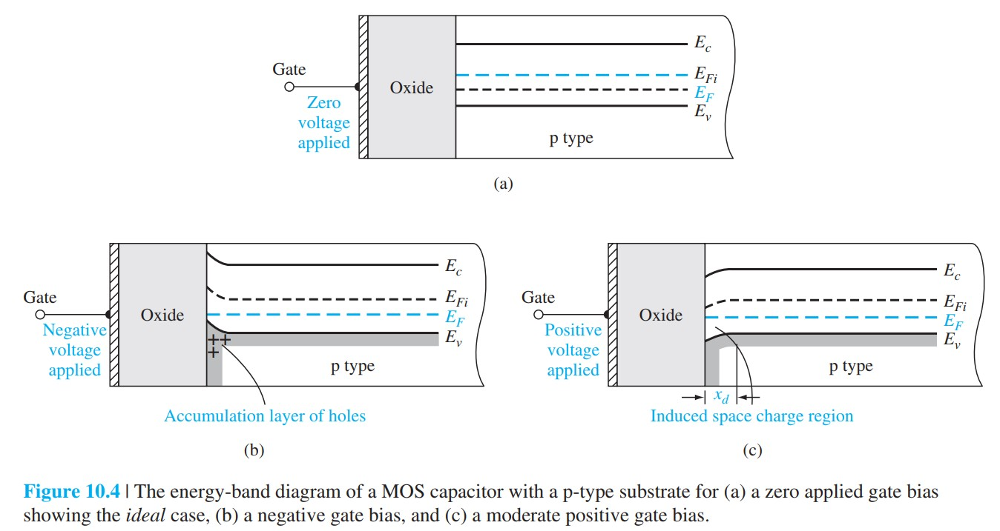
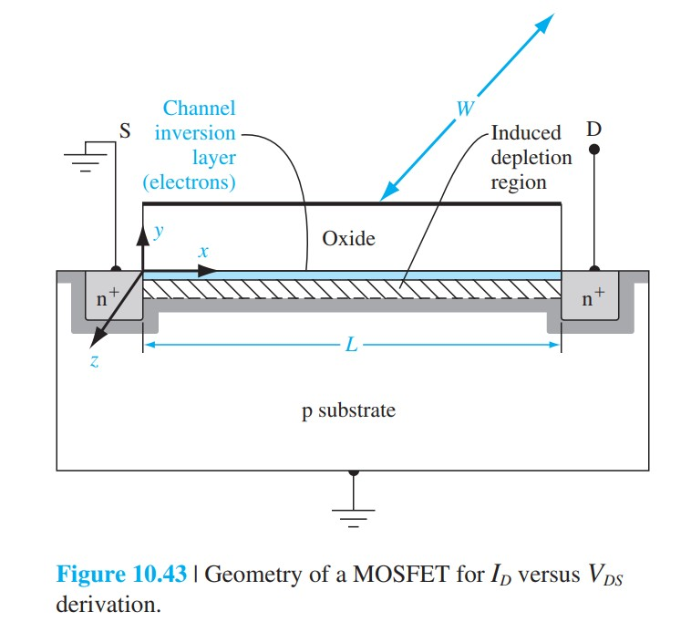
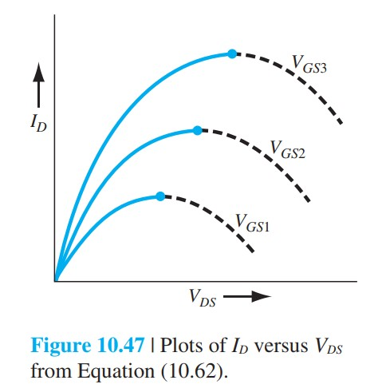

# MOS电容与MOSFET基础

标签：#MOS结构 #MOS电容 #MOSFET #Chapter10

来源：Chapter 10 *Fundamentals of the Metal–Oxide–Semiconductor Field-Effect Transistor*

## 本章一句话

MOSFET 的核心是 MOS 电容（MOS capacitor）：栅压通过氧化层电场调制半导体表面势（surface potential），使表面经历积累、耗尽、反型，并在反型层中形成可由栅压控制的沟道电流。

## 本章知识链

```text
MOS 电容结构
  -> 栅压改变半导体表面能带弯曲
  -> 积累 / 耗尽 / 反型
  -> 表面势与最大耗尽宽度
  -> 功函数差、氧化层电荷和平带电压
  -> 阈值电压
  -> C-V 特性
  -> MOSFET 沟道形成
  -> 线性区 / 饱和区 I-V
  -> 跨导、小信号模型和频率限制
  -> CMOS 基本思想
```

## 必要图片占位

> [!figure] Fig-10-1
> 
> MOS 电容基本结构：金属 / 氧化层 / 半导体。

> [!figure] Fig-10-4
> 
> p 型衬底 MOS 电容在零偏、负栅压和正栅压下的能带图。

> [!figure] Fig-10-43
> 
> n 沟道增强型 MOSFET 形成反型沟道的结构图。

> [!figure] Fig-10-47
> 
> 理想 MOSFET 的 $I_D$-$V_{DS}$ 曲线族。

## 本章核心问题

- 为什么 MOS 电容的栅极没有直流导通，却能控制半导体表面电荷？
- 积累（accumulation）、耗尽（depletion）、反型（inversion）的能带图如何判断？
- 为什么强反型阈值常取 $\phi_s=2\phi_f$？
- 平带电压（flat-band voltage）和阈值电压（threshold voltage）分别受哪些电荷项影响？
- 低频和高频 C-V 曲线为什么在反型区不同？
- MOSFET 的线性区和饱和区为什么都来自同一个沟道电荷积分？
- 跨导（transconductance）和截止频率（cutoff frequency）为什么随沟道长度缩短而提高？

## 与前后章节的连接

- 来自 [[金属半导体结与异质结]]：功函数差、界面电荷和接触概念是 MOS 能带分析的前置基础。
- 来自 [[03-半导体平衡态/费米能级位置]]：表面能带弯曲通过 $E_F$、$E_{Fi}$ 和载流子浓度联系起来。
- 连接到 [[MOSFET非理想效应总览]]：Chapter 11 会在本章理想模型上加入亚阈值、短沟道、速度饱和和热载流子效应。
