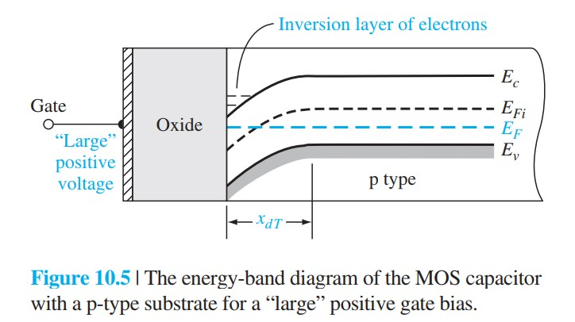
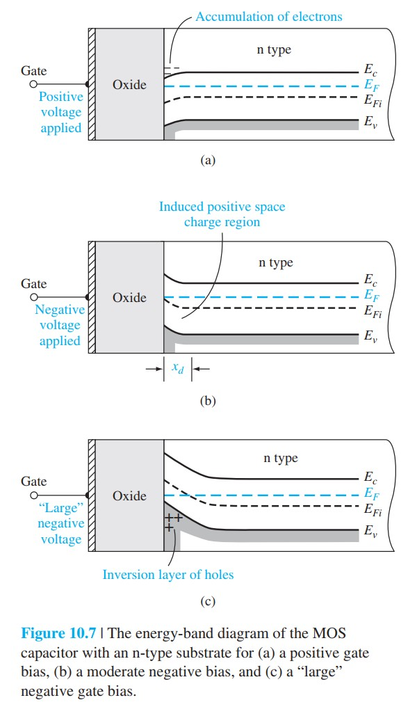

# MOS电容基础图像

标签：#MOS电容 #能带弯曲 #积累 #耗尽 #反型 #Chapter10

## 一句话理解

MOS 电容（MOS capacitor）用绝缘氧化层把金属栅和半导体隔开，因此没有直流栅电流；但栅压会通过氧化层电场改变半导体表面势，使表面从积累到耗尽再到反型。

## 基本结构

MOS 电容由三层组成：

```text
金属 / 多晶硅栅极
  -> 氧化层 SiO2
  -> 半导体衬底
```

单位面积氧化层电容为：

$$
C'_{ox}=\frac{\varepsilon_{ox}}{t_{ox}}
$$

氧化层越薄，$C'_{ox}$ 越大，同样栅压能控制更多半导体表面电荷。

> [!figure] Fig-10-1
> 
> MOS 电容结构与氧化层厚度 $t_{ox}$。

## p 型衬底：三种表面状态

### 1. 积累

当 p 型衬底上加负栅压时，栅极带负电，空穴被吸引到氧化层-半导体界面附近，形成积累层（accumulation layer）。

```text
负栅压
  -> 空穴向表面聚集
  -> 表面比体内更 p 型
```

### 2. 耗尽

当 p 型衬底上加适度正栅压时，空穴被排斥离开表面，表面附近留下不可动的电离受主离子，形成耗尽区（depletion region）。

```text
适度正栅压
  -> 空穴被推离表面
  -> 受主离子留下负空间电荷
  -> 能带向下弯曲
```

### 3. 反型

当正栅压足够大时，电子浓度在表面超过空穴浓度，表面等效变成 n 型，形成电子反型层（inversion layer）。

```text
大正栅压
  -> 表面导带接近费米能级
  -> 电子浓度快速增加
  -> p 型衬底表面反型为 n 型
```

> [!figure] Fig-10-4
> 
> p 型衬底 MOS 电容在零偏、负栅压、正栅压下的能带图。

> [!figure] Fig-10-5
> 
> 大正栅压下 p 型衬底表面形成电子反型层。

## n 型衬底的对称图像

n 型衬底中极性反过来：

- 正栅压：电子积累。
- 适度负栅压：电子被排斥，形成正空间电荷耗尽区。
- 大负栅压：表面形成空穴反型层。

> [!figure] Fig-10-7
> 
> n 型衬底 MOS 电容的积累、耗尽、反型能带图。

## 物理图像总结

MOS 电容不是靠栅极注入载流子，而是靠电场调制表面载流子浓度。

```text
栅压改变氧化层电场
  -> 氧化层电场终止在半导体表面电荷上
  -> 半导体表面势改变
  -> 载流子浓度按指数变化
```

## 易错点

- MOS 栅极被氧化层隔开，理想情况下直流栅电流为零。
- 反型层不是金属栅注入的电子，而是半导体内部热平衡 / 外电路提供的载流子在表面积累。
- “能带向上 / 向下弯曲”要结合电子能量图判断，不能只凭电压正负记忆。
- 强反型后，表面势继续增加很小就会让反型载流子指数增加，因此耗尽宽度近似饱和。

## 连接

- 后续 [[表面势耗尽层与反型]] 会把这一图像转化成 $\phi_s$、$x_d$ 和 $x_{dT}$。
- 后续 [[MOSFET结构与工作区]] 中的反型沟道就是 MOS 电容反型层沿源漏方向延伸形成的导电通道。
