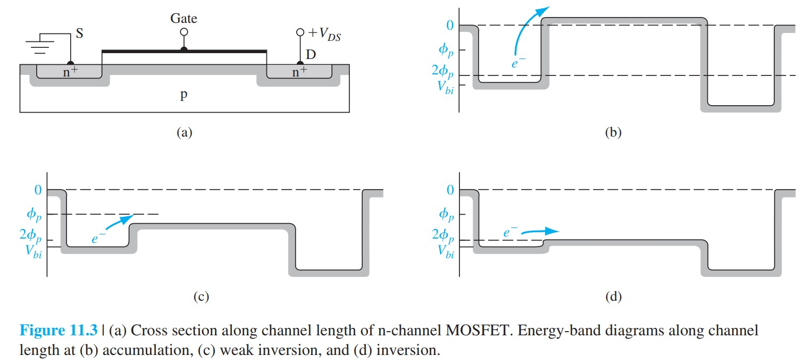

# 亚阈值导电

标签：#亚阈值导电 #弱反型 #漏电流 #Chapter11

## 一句话理解

亚阈值导电（subthreshold conduction）是 $V_{GS}<V_T$ 时仍然存在的弱反型沟道电流；它来自源端电子越过表面势垒进入沟道，电流随栅压近似指数变化。

## 物理图像

理想 MOSFET 模型认为 $V_{GS}\le V_T$ 时没有沟道，$I_D=0$。实际中，当表面势满足：

$$
\phi_{fp}<\phi_s<2\phi_{fp}
$$

p 型衬底表面已经接近 n 型，称为弱反型（weak inversion）。源和漏之间虽然没有强反型沟道，但仍有少量电子可以越过源端势垒形成电流。

> [!figure] Fig-11-1
> 
> 理想和实验 $\sqrt{I_D}$-$V_{GS}$ 曲线对比。

> [!figure] Fig-11-3
> 
> 积累、弱反型和反型时沟道方向的势垒变化。

## 近似公式

亚阈值电流可写成指数形式：

$$
I_D(sub)\propto \exp\left(\frac{eV_{GS}}{kT}\right)\left[1-\exp\left(-\frac{eV_{DS}}{kT}\right)\right]
$$

当 $V_{DS}$ 大于几个 $V_T=kT/e$ 后，括号中第二项接近 1，电流对 $V_{DS}$ 不再敏感，主要由 $V_{GS}$ 控制。

## 亚阈值摆幅

理想情况下，室温每增加约 $60\text{ mV}$ 栅压，亚阈值电流增加一个数量级。实际亚阈值摆幅（subthreshold swing）常大于 $60\text{ mV/dec}$，因为耗尽层电容和界面态电容也要参与电荷调制。

## 为什么重要

亚阈值导电决定数字电路的关断漏电：

```text
V_T 降低
  -> 开启更容易，速度提高
  -> 但关断时 V_GS=0 离阈值更近
  -> 亚阈值漏电增大
  -> 静态功耗上升
```

## 易错点

- 亚阈值电流不是栅氧漏电，而是源漏之间的沟道电流。
- $V_{GS}<V_T$ 不等于表面没有电子，只是尚未达到强反型。
- 降低阈值电压可提高速度，但会增加关断漏电。
- 亚阈值斜率可用于诊断界面态密度；界面态越多，斜率越差。

## 连接

- 前接 [[功函数差平带电压与阈值电压]]。
- 后接 [[MOSFET缩放]]：缩放中阈值电压不能任意降低，亚阈值漏电是主要限制。
