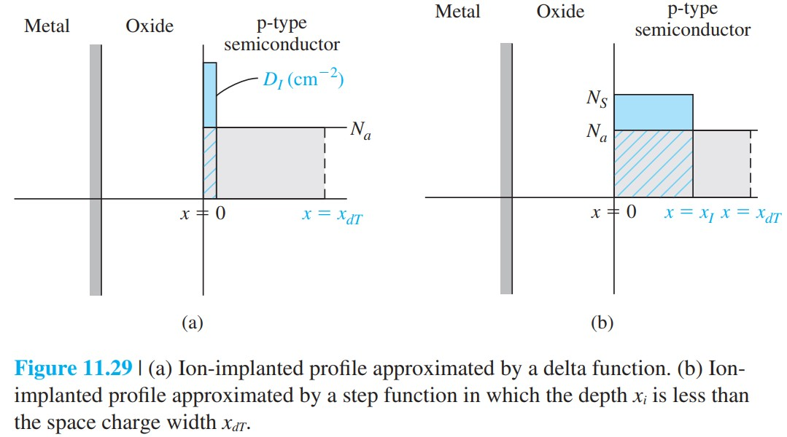

# 离子注入调阈值

标签：#离子注入 #阈值调整 #MOSFET工艺 #Chapter11

## 一句话理解

离子注入调阈值（threshold adjustment by ion implantation）通过在氧化层-半导体界面附近引入受主或施主离子，改变耗尽层空间电荷，从而把 MOSFET 的阈值电压调到设计目标。

## 为什么需要调阈值

阈值电压受很多因素影响：

- 栅材料和半导体的功函数差。
- 氧化层厚度。
- 氧化层固定电荷和界面态。
- 衬底掺杂浓度。
- 衬底偏置。

这些参数由工艺和电路要求共同限制，不一定自然给出合适的 $V_T$。离子注入可以局部、精确地改变表面附近掺杂，从而调节 $V_T$。

## 基本方向

对 p 型衬底 n 沟道 MOSFET：

- 注入受主离子：增加负空间电荷，需要更高正栅压反型，$V_T$ 向正方向移动。
- 注入施主离子：抵消受主电荷，$V_T$ 向负方向移动。

一般结论：

```text
受主注入 -> V_T 更正
施主注入 -> V_T 更负
```

这可用于把耗尽型器件调成增强型，也可把增强型器件调成耗尽型。

> [!figure] Fig-11-29
> 
> 离子注入剖面：delta 函数近似和有限深度阶跃近似。

## delta 函数注入近似

若把注入剂量近似为位于界面的片电荷，单位面积注入剂量为 $D_I$，则阈值电压偏移为：

$$
\Delta V_T=\frac{eD_I}{C'_{ox}}
$$

这里符号取决于注入离子类型。受主注入使 $V_T$ 正移，施主注入使 $V_T$ 负移。

## 阶跃注入近似

若注入形成从表面到深度 $x_I$ 的均匀掺杂变化，则可用等效片剂量：

$$
D_I=(N_s-N_A)x_I
$$

当注入区位于阈值耗尽层内时，阈值偏移仍可近似写为：

$$
\Delta V_T=\frac{eD_I}{C'_{ox}}
$$

## 物理图像

阈值电压中有一项来自最大耗尽层电荷：

$$
V_T=V_{FB}+2\phi_f+\frac{|Q'_{SD}(max)|}{C'_{ox}}
$$

离子注入改变的就是 $Q'_{SD}(max)$，因此改变 $V_T$。

## 易错点

- 离子注入调阈值不是改变氧化层电容，而是改变半导体表面附近空间电荷。
- 受主 / 施主注入对 $V_T$ 的方向要结合衬底类型和目标沟道判断。
- 注入剂量越大，阈值偏移越大；氧化层越薄，$C'_{ox}$ 越大，同样剂量产生的 $\Delta V_T$ 越小。
- 离子注入会引入晶格损伤，实际工艺常需要退火修复。

## 连接

- 前接 [[功函数差平带电压与阈值电压]]。
- 连接 [[短沟道与窄沟道阈值修正]]：现代器件中阈值控制还要同时考虑尺寸效应。
