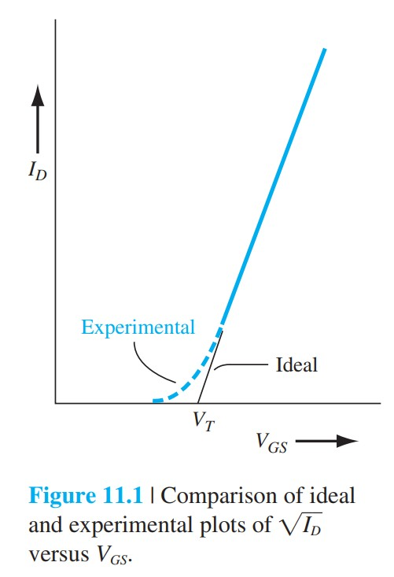
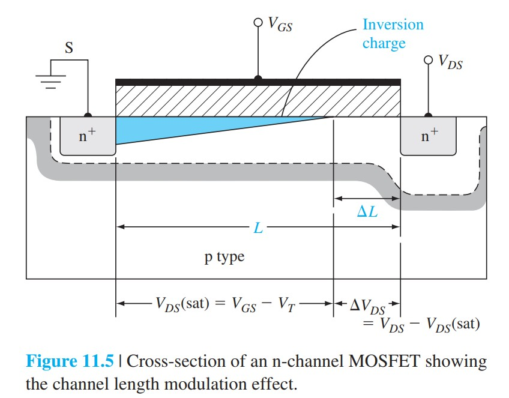
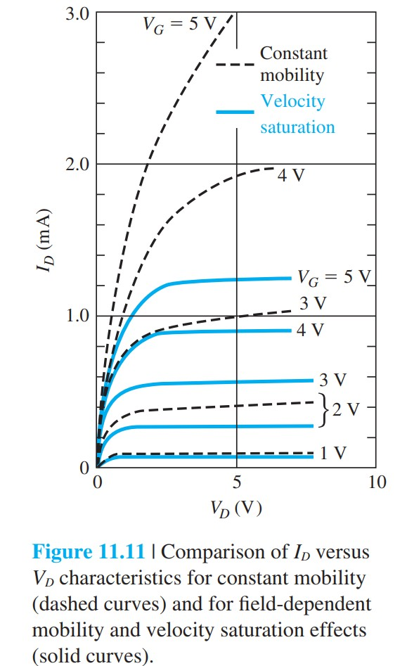
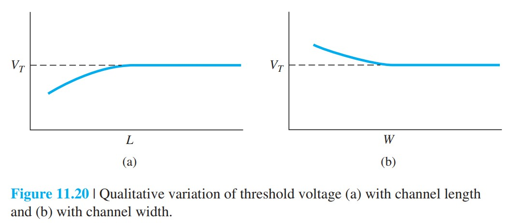
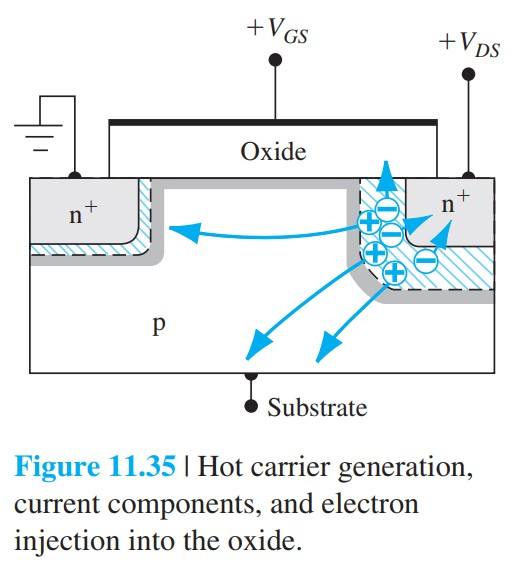

# 第十一章公式与考点速查

标签：#公式速查 #考点速查 #MOSFET #非理想效应 #Chapter11

## 一句话总览

Chapter 11 的考点是“理想 MOSFET 为什么失效”：亚阈值电流、沟道长度调制、迁移率退化、速度饱和、尺寸缩放、阈值修正、击穿和可靠性。

## 1. 亚阈值电流

$$
I_D(sub)\propto \exp\left(\frac{eV_{GS}}{kT}\right)\left[1-\exp\left(-\frac{eV_{DS}}{kT}\right)\right]
$$

室温理想极限：约 $60\text{ mV/dec}$。

考点：$V_{GS}<V_T$ 不代表 $I_D=0$。

## 2. 沟道长度调制

有效沟道长度：

$$
L_{eff}=L-\Delta L
$$

电流修正：

$$
I_D'\approx\frac{L}{L-\Delta L}I_D
$$

经验饱和区模型：

$$
I_D'=\frac{k_n}{2}\frac{W}{L}(V_{GS}-V_T)^2(1+\lambda V_{DS})
$$

输出电阻：

$$
r_o\approx\frac{1}{\lambda I_D}
$$

## 3. 有效垂直电场与迁移率退化

$$
E_{eff}=\frac{1}{\varepsilon_s}\left(|Q'_{SD}(max)|+\frac{1}{2}Q'_n\right)
$$

$$
\mu_{eff}=\mu_0\left(\frac{E_{eff}}{E_0}\right)^{-1/3}
$$

考点：垂直电场越强，表面散射越强，迁移率越低。

## 4. 速度饱和

速度饱和近似饱和电流：

$$
I_D(sat)=WC'_{ox}(V_{GS}-V_T)v_{sat}
$$

跨导：

$$
g_{ms}=WC'_{ox}v_{sat}
$$

截止频率：

$$
f_T=\frac{v_{sat}}{2\pi L}
$$

考点：速度饱和后 $I_D(sat)$ 对 $V_{GS}$ 近似线性，不再是平方律。

## 5. 常电场缩放

缩放因子 $k<1$：

```text
L, W, t_ox, x_j -> k 倍
V -> k 倍
N_A, N_D -> 1/k 倍
电场 -> 约不变
面积 -> k^2 倍
延迟 -> k 倍
单器件功耗 -> k^2 倍
```

考点：电压若不同比例降低，电场会升高，可靠性问题加重。

## 6. 短沟道效应

短沟道使源漏耗尽区分担栅控电荷：

$$
V_T=V_{T0}-\Delta V_T
$$

趋势：$L$ 越短，$V_T$ 越低，DIBL 越明显。

## 7. 窄沟道效应

额外边缘耗尽电荷导致：

$$
\Delta V_T=\frac{eN_Ax_{dT}}{C'_{ox}}\left(\frac{\eta x_{dT}}{W}\right)
$$

趋势：$W$ 越窄，$V_T$ 越高。

## 8. 离子注入调阈值

delta 函数片电荷近似：

$$
\Delta V_T=\frac{eD_I}{C'_{ox}}
$$

阶跃注入等效剂量：

$$
D_I=(N_s-N_A)x_I
$$

考点：受主注入通常使 $V_T$ 正移，施主注入通常使 $V_T$ 负移。

## 9. 必会图像占位

> [!figure] Fig-11-1
> 
> 亚阈值电流导致实验曲线偏离理想开关。

> [!figure] Fig-11-5
> 
> 沟道长度调制。

> [!figure] Fig-11-11
> 
> 速度饱和降低饱和电流。

> [!figure] Fig-11-20
> 
> 短沟道降低 $V_T$，窄沟道提高 $V_T$。

> [!figure] Fig-11-35
> 
> 热电子注入氧化层。

## 易错点清单

- 亚阈值电流是源漏电流，不是栅氧漏电。
- 沟道长度调制让饱和区有正斜率，输出电阻有限。
- 迁移率退化和速度饱和分别对应垂直电场、横向电场。
- 短沟道和窄沟道对 $V_T$ 的影响方向相反。
- LDD 降低峰值电场，但会增加串联电阻。
- 辐射电荷和热电子电荷会长期改变阈值电压和迁移率。
