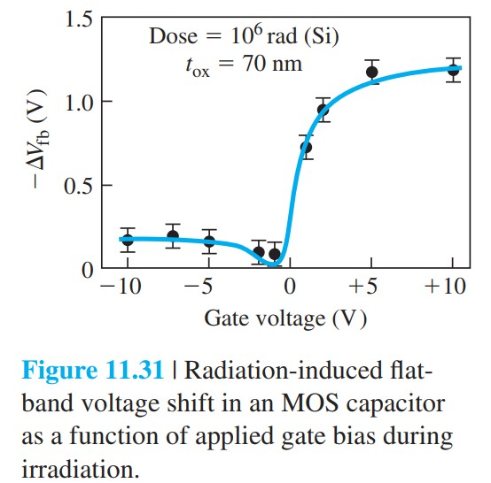
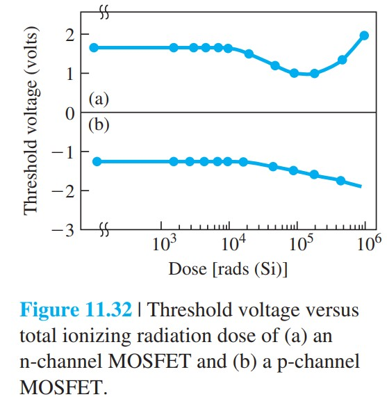
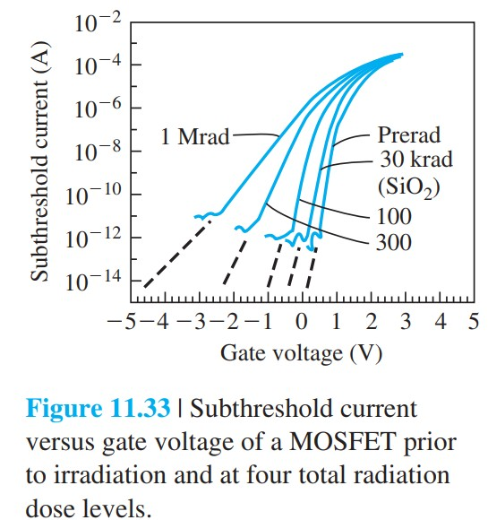

# 辐射与热电子效应

标签：#辐射效应 #热电子 #氧化层电荷 #界面态 #可靠性 #Chapter11

## 一句话理解

MOSFET 的长期可靠性常受氧化层和 Si-SiO2 界面影响：电离辐射会在氧化层和界面产生电荷与陷阱，热电子会从漏端高场区注入氧化层，两者都会导致阈值漂移、迁移率下降和器件退化。

## 辐射诱导氧化层电荷

电离辐射（ionizing radiation）在 SiO2 中产生电子-空穴对。电子迁移率高，较容易离开氧化层；空穴迁移慢，容易被陷阱捕获，形成正氧化层电荷。

```text
辐射产生 e-h 对
  -> 电子较快移走
  -> 空穴被氧化层陷阱捕获
  -> 正氧化层电荷积累
  -> V_T 发生偏移
```

正氧化层电荷对 nMOS 和 pMOS 的阈值影响通常都向负方向移动。

> [!figure] Fig-11-31
> 
> 辐射在氧化层中产生电子-空穴对及空穴俘获示意。

## 辐射诱导界面态

辐射也会在 Si-SiO2 界面产生界面态（interface states）。界面态会：

- 改变阈值电压。
- 增大亚阈值摆幅。
- 增强表面散射，降低迁移率。
- 改变器件噪声和可靠性。

界面态建立常有明显时间依赖和氧化层电场依赖。

> [!figure] Fig-11-32
> 
> 总电离剂量对 nMOS / pMOS 阈值电压的影响。

> [!figure] Fig-11-33
> 
> 辐射剂量增加后亚阈值曲线斜率变化。

## 热电子效应

短沟道 nMOS 漏端高电场可产生碰撞电离。部分高能电子称为热电子（hot electrons），可能越过或隧穿进入氧化层。

```text
漏端高电场
  -> 碰撞电离产生高能电子
  -> 热电子被栅电场吸向氧化层
  -> 部分进入氧化层并被俘获
  -> 形成负氧化层电荷
  -> 局部 V_T 正移，迁移率下降
```

> [!figure] Fig-11-35
> 
> 热电子产生、电流分量和电子注入氧化层示意。

## 与 LDD 的关系

LDD 结构降低漏端峰值电场，从而降低：

- 碰撞电离概率。
- 热电子注入概率。
- 氧化层和界面态退化速度。

因此 LDD 是短沟道可靠性设计的重要结构。

## 易错点

- 辐射诱导氧化层电荷通常以正电荷为主；热电子注入常产生负氧化层电荷。
- 阈值漂移方向要看电荷类型、器件类型和位置，不能只背一个方向。
- 界面态不仅移动 $V_T$，还会降低迁移率和恶化亚阈值摆幅。
- 热电子效应是长期退化过程，不一定在短时间 I-V 测量中立刻显现。

## 连接

- 前接 [[MOSFET击穿与穿通]]：热电子来自漏端高场和碰撞电离。
- 连接 [[亚阈值导电]]：界面态会改变亚阈值曲线斜率。
- 连接 [[迁移率退化速度饱和与弹道输运]]：界面态和氧化层电荷会增强表面散射。
