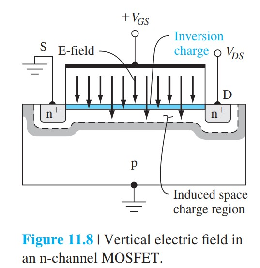
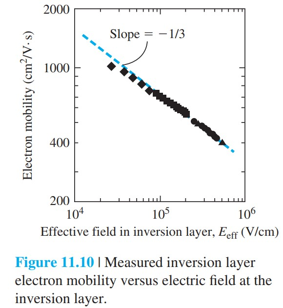

# 迁移率退化速度饱和与弹道输运

标签：#迁移率退化 #速度饱和 #弹道输运 #短沟道 #Chapter11

## 一句话理解

短沟道 MOSFET 中，载流子不再服从“恒定迁移率 + 漂移速度无限随电场增加”的理想假设；垂直电场导致表面散射和迁移率退化，横向高电场导致速度饱和，极短沟道还可能出现弹道输运（ballistic transport）。

## 迁移率退化

反型层电子被栅极垂直电场压向 Si-SiO2 界面。电子沿沟道运动时会受到界面粗糙、固定电荷和库仑散射影响，称为表面散射（surface scattering）。

有效垂直电场可写作：

$$
E_{eff}=\frac{1}{\varepsilon_s}\left(|Q'_{SD}(max)|+\frac{1}{2}Q'_n\right)
$$

经验上，有效迁移率随垂直电场增大而降低：

$$
\mu_{eff}=\mu_0\left(\frac{E_{eff}}{E_0}\right)^{-1/3}
$$

> [!figure] Fig-11-8
> 
> n 沟道 MOSFET 中的垂直电场。

> [!figure] Fig-11-10
> 
> 反型层电子迁移率随有效垂直电场降低。

## 速度饱和

理想长沟道模型假设：

$$
v_d=\mu E
$$

但当横向电场足够大时，漂移速度趋向饱和值 $v_{sat}$。短沟道中同样的 $V_{DS}$ 分布在更短长度上，平均电场更大，因此更容易速度饱和。

速度饱和时，饱和电流近似为：

$$
I_D(sat)=WC'_{ox}(V_{GS}-V_T)v_{sat}
$$

对应跨导：

$$
g_{ms}=WC'_{ox}v_{sat}
$$

此时 $I_D(sat)$ 对 $V_{GS}$ 近似线性，而不是理想长沟道平方律。

速度饱和下截止频率近似为：

$$
f_T=\frac{v_{sat}}{2\pi L}
$$

> [!figure] Fig-11-11
> 
> 常数迁移率和场依赖迁移率模型下的 $I_D$-$V_D$ 曲线对比。

## 弹道输运

当沟道长度 $L$ 接近或小于平均散射距离时，部分载流子可几乎不发生散射地从源到漏运动，这称为弹道输运（ballistic transport）。

```text
长沟道：多次散射 -> 漂移速度模型有效
短沟道：少量散射 -> 速度饱和模型更重要
极短沟道：近似无散射 -> 弹道输运显著
```

## 易错点

- 迁移率退化主要由垂直电场和界面散射引起；速度饱和主要由横向电场引起。
- 速度饱和会降低实际 $I_D(sat)$，并使其对 $V_{GS}$ 的依赖从平方律变弱。
- 提高 $V_{GS}$ 不一定按平方律提高电流，因为迁移率会继续降低。
- 弹道输运不是“没有电阻”，而是经典漂移-扩散模型不再完全适用。

## 连接

- 前接 [[MOSFET跨导小信号与频率限制]]。
- 后接 [[MOSFET缩放]]：器件缩小会同时增强高场效应和弹道输运重要性。
