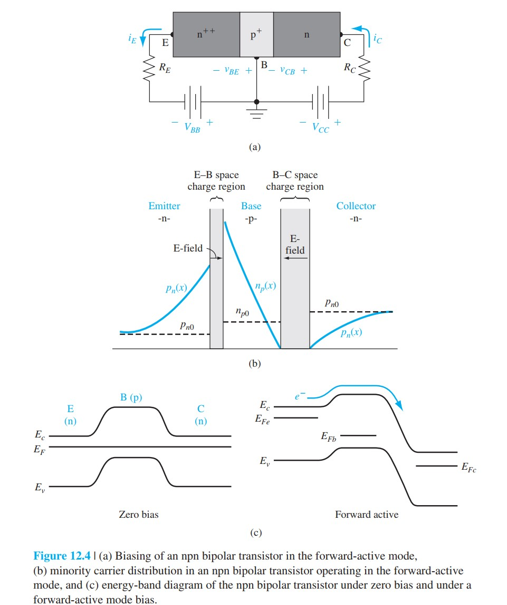
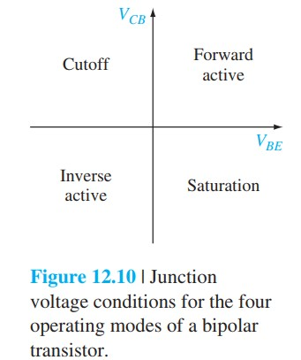
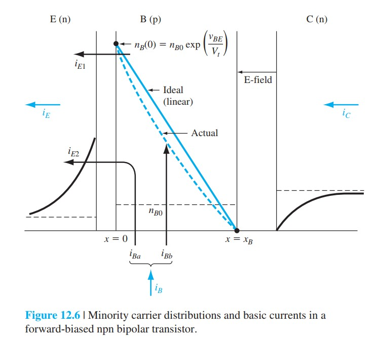
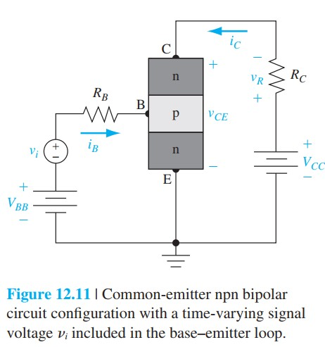
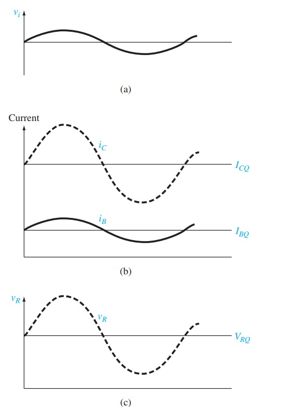

# BJT工作模式与电流增益

标签：#BJT #工作模式 #电流增益 #正向有源区 #Chapter12

## 一句话理解

BJT 的四种工作模式由基极-发射极结（base-emitter junction, B-E junction）和基极-集电极结（base-collector junction, B-C junction）的偏置状态决定；最重要的是正向有源区，此时 $i_C\approx \alpha i_E\approx \beta i_B$，可实现电流和电压放大。

## npn 正向有源区图像

正向有源区（forward-active mode）条件：

```text
B-E 结正偏
B-C 结反偏
```

对 npn BJT：

- 发射极（emitter）向基区注入电子。
- 电子在窄基区中扩散。
- 电子到达 B-C 耗尽区后，被反偏电场扫入集电极（collector）。
- 集电极电流主要由 $v_{BE}$ 控制。

理想近似：

$$
i_C=I_S\exp\left(\frac{v_{BE}}{V_T}\right)
$$

> [!figure] Fig-12-4
> 
> npn BJT 正向有源区的偏置、少数载流子分布和能带图。

## 四种工作模式

| 模式 | B-E 结 | B-C 结 | 物理含义 |
|---|---|---|---|
| 截止（cutoff） | 反偏 / 零偏 | 反偏 | 几乎无注入，电流近似为零 |
| 正向有源（forward active） | 正偏 | 反偏 | 放大区，$i_C$ 由 $v_{BE}$ 控制 |
| 饱和（saturation） | 正偏 | 正偏 | 两个结都注入，$i_C$ 不再由 $v_{BE}$ 单独控制 |
| 反向有源（inverse active） | 反偏 | 正偏 | 发射极和集电极角色反过来，但性能较差 |

> [!figure] Fig-12-10
> 
> 四种工作模式对应的结电压条件。

## 电流增益定义

共基极电流增益（common-base current gain）：

$$
\alpha=\frac{i_C}{i_E}
$$

由于 $i_C<i_E$，所以：

$$
\alpha<1
$$

共发射极电流增益（common-emitter current gain）：

$$
\beta=\frac{i_C}{i_B}
$$

三端电流关系：

$$
i_E=i_C+i_B
$$

因此：

$$
\beta=\frac{\alpha}{1-\alpha}
$$

$$
\alpha=\frac{\beta}{\beta+1}
$$

小小的 $1-\alpha$ 会被放大成很大的 $\beta$。例如 $\alpha=0.99$ 时，$\beta\approx 99$。

## 为什么基极电流小

基极电流主要来自两部分：

1. B-E 结中从基区注入到发射极的空穴电流。
2. 基区中电子与空穴复合，需要基极补充空穴。

所以降低基极电流的设计方向是：

```text
发射极重掺杂
  -> 减小基区向发射极的空穴注入
基区做窄
  -> 减少电子在基区复合
```

> [!figure] Fig-12-6
> 
> 正向有源区的电流分量：$i_E$、$i_C$、$i_B$ 以及基区复合。

## 共发射极放大

共发射极电路中：

$$
i_C\approx \beta i_B
$$

输入端小的 $v_{BE}$ 或 $i_B$ 变化，会引起较大的集电极电流变化，再经负载电阻 $R_C$ 转换成输出电压变化。

> [!figure] Fig-12-11
> 
> 共发射极放大电路。

> [!figure] Fig-12-12
> 
> 输入信号、基极电流、集电极电流和输出电压的时间变化。

## 易错点

- BJT 的“饱和”与 MOSFET 饱和区含义不同：BJT 饱和是两个结都正偏。
- $\alpha$ 接近 1，但永远不是理想放大倍数；常用放大倍数是 $\beta$。
- 正向有源区中 $i_C$ 近似与 $v_{CB}$ 无关，但实际会受 Early 效应影响。
- pnp 的电压极性和电流方向与 npn 相反，但物理机制相同。

## 连接

- 后续 [[BJT少数载流子分布与电流]] 会用扩散方程推导 $i_C$、$i_E$ 和 $i_B$。
- 后续 [[BJT电流增益非理想效应]] 会把 $\alpha$ 拆成发射效率、基区输运因子等物理因子。
