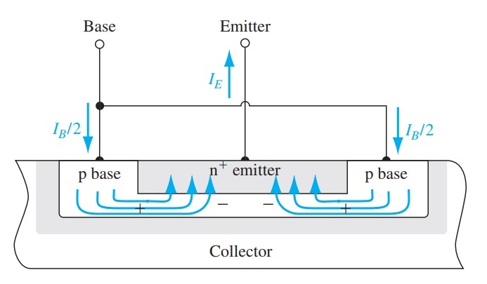
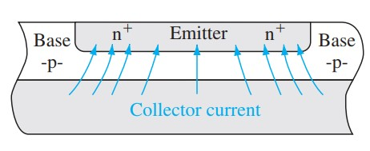
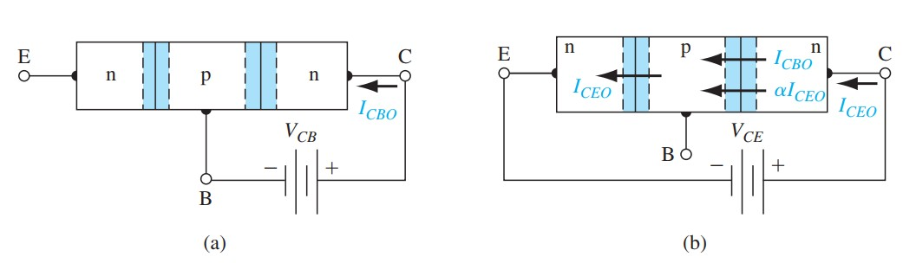

# BJT电流增益非理想效应

标签：#BJT #电流增益 #Early效应 #高注入 #击穿 #Chapter12

## 一句话理解

BJT 的电流增益不是一个纯电路常数，而是由发射效率、基区输运、复合、基区宽度调制和高注入等物理过程共同决定；任何让更多载流子在到达集电极前“损失”的机制都会降低增益。

## 共基极电流增益的分解

共基极电流增益：

$$
\alpha=\frac{i_C}{i_E}
$$

常分解为：

$$
\alpha=\gamma\alpha_T
$$

其中：

- $\gamma$：发射效率（emitter injection efficiency），表示发射极注入到基区的电子电流在总发射极电流中的比例。
- $\alpha_T$：基区输运因子（base transport factor），表示注入基区的电子中有多少能穿过基区到达集电极。

## 发射效率

发射效率希望接近 1：

$$
\gamma=\frac{i_{E,n}}{i_{E,n}+i_{E,p}}
$$

其中 $i_{E,n}$ 是电子从 n+ 发射极注入 p 型基区的电流，$i_{E,p}$ 是空穴从基区注入发射极的电流。

提高 $\gamma$ 的方法：

```text
发射极重掺杂
  -> 降低发射区少数空穴浓度
  -> 减小空穴注入发射极电流
  -> 发射效率提高
```

## 基区输运因子

基区输运因子希望接近 1。若基区宽度 $x_B$ 远小于少数载流子扩散长度 $L_B$，则复合少，$\alpha_T$ 高。

近似关系：

$$
\alpha_T\approx 1-\frac{1}{2}\left(\frac{x_B}{L_B}\right)^2
$$

因此减小基区宽度可以提高电流增益，但会带来基区宽度调制、击穿和工艺控制问题。

## Early 效应 / 基区宽度调制

当 B-C 结反偏增加时，B-C 耗尽区向基区伸展，使中性基区宽度变窄：

```text
V_CB 增大
  -> B-C 耗尽区变宽
  -> 中性基区宽度 x_B 变小
  -> 基区浓度梯度变大
  -> i_C 增大
```

这称为 Early 效应（Early effect）或基区宽度调制（base width modulation）。输出特性不再水平，而是外推交于 Early 电压 $V_A$。

> [!figure] Fig-12-27
> 
> B-C 反偏改变中性基区宽度的 Early 效应示意。

> [!figure] Fig-12-28
> 
> 共发射极输出曲线外推得到 Early 电压。

## 高注入效应

低注入假设要求注入的少数载流子浓度远小于基区多数载流子浓度。高电流下：

$$
\Delta n_B \sim N_B
$$

此时基区电中性需要多数载流子浓度也明显改变，理想指数关系和增益都会偏离。

高注入常导致：

- $i_C$-$v_{BE}$ 斜率改变。
- 基区电导调制。
- 电流增益下降。

## 击穿效应

BJT 中常见击穿包括：

- B-C 结雪崩击穿。
- 共发射极击穿中，雪崩产生的空穴可增加基极电流并被晶体管作用放大。
- 穿通（punch-through）：B-C 耗尽区穿过基区接近 B-E 结，器件失去正常控制。

> [!figure] Fig-12-34
> 
> 共基极和共发射极击穿特性对比。

## 易错点

- $\beta$ 很大并不意味着 $\alpha$ 可以明显小于 1；实际上 $\beta$ 对 $1-\alpha$ 极其敏感。
- 发射极重掺杂提高发射效率，但过高掺杂也可能引入重掺杂效应和带隙窄化。
- Early 效应不是新的注入机制，而是有效基区宽度随 $V_{CB}$ 变化。
- 高注入不是“电流大一点”这么简单，而是低注入假设失效。

## 连接

- 前接 [[BJT少数载流子分布与电流]]。
- 后接 [[BJT小信号频率与开关]]：$g_m$、$r_o$、电容和存储电荷都受这些非理想效应影响。
