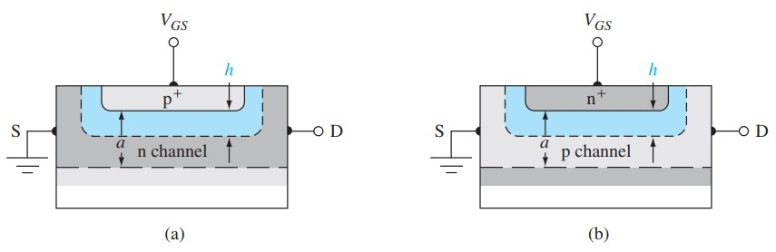
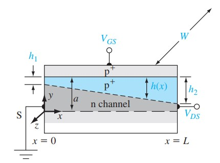
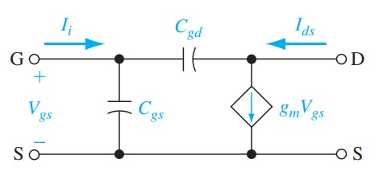
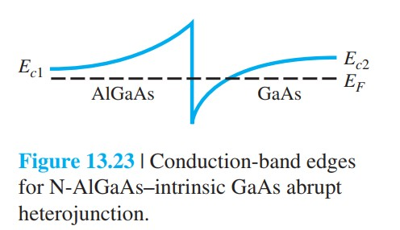

# JFET夹断电压与理想IV

标签：#JFET #夹断电压 #理想IV #跨导 #Chapter13

## 一句话理解

JFET 的漏电流公式来自“栅控耗尽区改变有效沟道厚度”：局部沟道厚度越小，局部电导越低；当漏端沟道刚好夹断时进入饱和区。

## 内部夹断电压

以一侧 n 沟道 pn JFET 为例，沟道厚度为 $a$，沟道掺杂为 $N_D$。耗尽层宽度为：

$$
h=\left[\frac{2\varepsilon_s(V_{bi}-V_{GS})}{eN_D}\right]^{1/2}
$$

当 $h=a$ 时，沟道完全耗尽。定义内部夹断电压（internal pinchoff voltage）：

$$
V_{p0}=\frac{eN_Da^2}{2\varepsilon_s}
$$

实际关断所需栅源电压称为夹断电压（pinchoff voltage）：

$$
V_p=V_{bi}-V_{p0}
$$

对 n 沟道耗尽型 JFET，通常 $V_p<0$。

> [!figure] Fig-13-10
> 
> 简化一侧 n 沟道和 p 沟道 pn JFET 几何参数。

## 漏端夹断与饱和电压

当同时施加 $V_{GS}$ 和 $V_{DS}$ 时，漏端反偏最大，漏端耗尽层最宽。漏端夹断条件给出：

$$
V_{DS}(sat)=V_{GS}-V_p
$$

对 n 沟道耗尽型器件，$V_p$ 为负，因此 $V_{GS}$ 越负，达到饱和所需的 $V_{DS}$ 越小。

> [!figure] Fig-13-11
> 
> 沟道中源端和漏端耗尽宽度不同，漏端先夹断。

## 理想电流方程的结构

JFET 沟道电流可从局部电导积分得到。线性区中，电流随 $V_{DS}$ 增加；但随着 $V_{DS}$ 增加，漏端耗尽层变宽，等效沟道电导下降，因此曲线逐渐弯曲。

饱和区常用 Shockley 近似式记忆：

$$
I_D=I_{DSS}\left(1-\frac{V_{GS}}{V_p}\right)^2
$$

其中 $I_{DSS}$ 是 $V_{GS}=0$ 时的饱和漏电流。注意对 n 沟道耗尽型 JFET，$V_p<0$。

## 转移特性

转移特性（transfer characteristic）是 $I_D$ 随 $V_{GS}$ 的变化：

```text
V_GS = 0
  -> 沟道最宽，I_D = I_DSS

V_GS 变负
  -> 沟道变窄，I_D 下降

V_GS = V_p
  -> 沟道夹断，I_D 近似为 0
```

> [!figure] Fig-13-22
> 
> JFET 理想输出特性族。

> [!figure] Fig-13-23
> 
> JFET 转移特性 $I_D$-$V_{GS}$。

## 跨导

跨导定义：

$$
g_m=\frac{\partial I_D}{\partial V_{GS}}
$$

由 Shockley 近似式：

$$
g_m=g_{m0}\left(1-\frac{V_{GS}}{V_p}\right)
$$

其中：

$$
g_{m0}=\frac{2I_{DSS}}{|V_p|}
$$

## 易错点

- $V_{p0}$ 是内部电势量，通常为正；$V_p$ 是外加栅源夹断电压，对 n 沟道耗尽型通常为负。
- 漏端夹断表示进入饱和区，不是器件关断。
- 栅压夹断整个沟道才是关断。
- Shockley 平方律是理想近似，短沟道、速度饱和和沟道长度调制会改变输出特性。

## 连接

- 前接 [[pnJFET与MESFET工作图像]]。
- 后接 [[JFET跨导小信号频率与HEMT]]。
