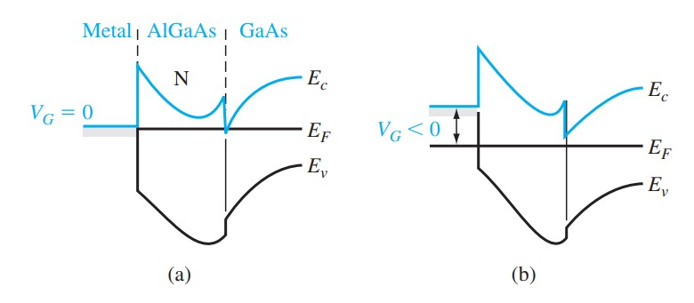
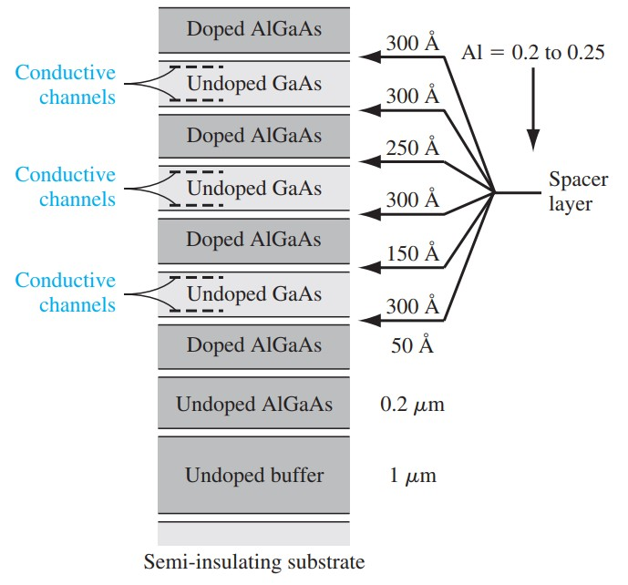
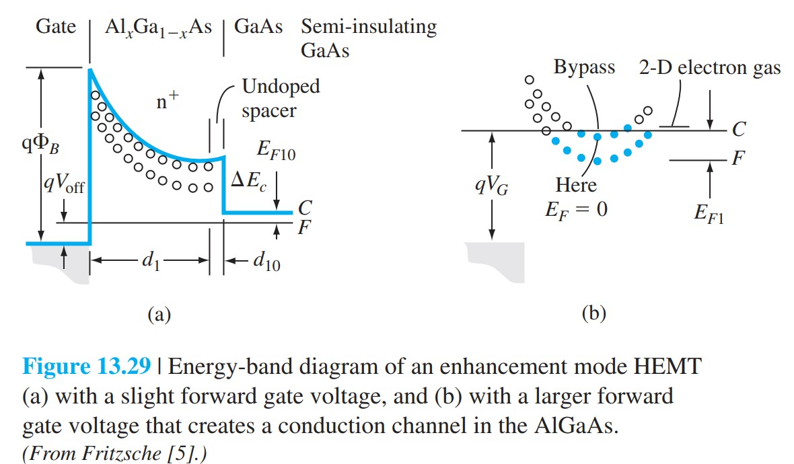

# JFET跨导小信号频率与HEMT

标签：#JFET #MESFET #小信号模型 #频率响应 #HEMT #Chapter13

## 一句话理解

JFET / MESFET 的小信号放大能力由栅压对沟道电导的调制强度决定；高频性能受栅电容、沟道渡越时间、寄生电阻电容限制，而 HEMT 通过异质结二维电子气沟道进一步提高迁移率和速度。

## 小信号模型

JFET 小信号模型常包含：

- 受控电流源 $g_m v_{gs}$。
- 输出电阻 $r_{ds}$，来自沟道长度调制等非理想效应。
- 栅源电容 $C_{gs}$。
- 栅漏电容 $C_{gd}$。
- 源 / 漏串联电阻。

> [!figure] Fig-13-28
> 
> JFET 小信号等效电路。

跨导定义：

$$
g_m=\frac{\partial I_D}{\partial V_{GS}}
$$

输出电阻定义：

$$
r_{ds}=\left(\frac{\partial I_D}{\partial V_{DS}}\right)^{-1}
$$

理想饱和区中 $r_{ds}\to\infty$，实际器件因沟道长度调制而有限。

## 非理想效应

### 沟道长度调制

当 $V_{DS}$ 超过饱和电压后，漏端空间电荷区继续向源端扩展，使有效沟道长度减小，导致 $I_D$ 随 $V_{DS}$ 增大而略增。

### 速度饱和

短沟道或高场 MESFET 中，载流子速度接近饱和值，漏电流不再按低场迁移率模型增加。GaAs 电子迁移率高，因此 MESFET 高频性能优于普通 Si pn JFET。

> [!figure] Fig-13-25
> 
> JFET 非理想输出特性中的沟道长度调制。

## 频率响应

JFET 高频性能的限制包括：

```text
栅电容充放电
  -> 输入端 RC 延迟
沟道渡越时间
  -> 载流子从源到漏需要有限时间
寄生电阻和寄生电容
  -> 降低增益和截止频率
```

截止频率可用电流增益为 1 的频率理解，趋势上：

$$
f_T\propto \frac{g_m}{C_{gs}+C_{gd}}
$$

提高 $f_T$ 的方向：

- 缩短栅长。
- 提高沟道迁移率和饱和速度。
- 降低栅电容和寄生电容。
- 减小源漏串联电阻。

## HEMT 图像

高电子迁移率晶体管（high-electron-mobility transistor, HEMT）可看作异质结 FET。它利用 AlGaAs/GaAs 等异质结在界面形成二维电子气（two-dimensional electron gas, 2-DEG）作为沟道。

```text
宽带隙掺杂层提供电子
  -> 电子转移到窄带隙侧势阱
  -> 形成 2-DEG
  -> 电子与离化杂质空间分离
  -> 散射减少，迁移率提高
```

> [!figure] Fig-13-29
> 
> HEMT 异质结、二维电子气和栅控沟道示意。

## HEMT 与 MESFET 对比

| 项目 | MESFET | HEMT |
|---|---|---|
| 沟道 | 掺杂半导体层 | 异质结 2-DEG |
| 主要优势 | 结构简单，高速 | 迁移率更高，高频更强 |
| 散射 | 沟道内有离化杂质散射 | 调制掺杂使电子与杂质分离 |
| 栅控 | 肖特基栅耗尽沟道 | 肖特基栅调制 2-DEG 浓度 |

## 易错点

- JFET 的栅电流理想上很小，但不是绝缘栅；反偏结电容仍限制高频。
- MESFET 常用 GaAs，不是因为只能用 GaAs，而是 GaAs 高迁移率和半绝缘衬底更适合高频。
- HEMT 的高迁移率来自空间分离和二维电子气，不只是材料带隙不同。
- $g_m$ 大不一定频率高，寄生电容和串联电阻也很关键。

## 连接

- 前接 [[JFET夹断电压与理想IV]]。
- 来自 [[07-MOS结构/二维电子气]] 和 [[07-MOS结构/半导体异质结]]。
